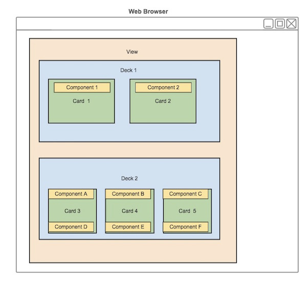
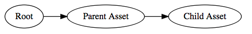

# Create the dashboard
In this tutorial we will be working with Predix View service and Asset Service to build a hierarchical display and navigation of asset data, assembling all that into a dashboard view.

You will be using the following Predix UI elements:

* iron-ajax
* px-context-browser
* px-deck-selector
* px-deck/px-deck-index
* px-card

## Understanding View service
Predix UI combines the following set of elements to create web applications that run on top of Predix services and data, which is typically referred to as **dashboard**:

* **Component** – User-interface element that allows you to add features or access services following consistent UX practices, standards and specification.
* **Card** – Component that resides within the content area of the user interface. You can create interactions between components within an individual card, as well as interactions with other cards based on user context.
* **Deck** – Component that supplies simple one-dimensional layout control for cards and components arranged in a specified order. This control can originate from the deck itself.
* **View** – Visual summary of the information displayed in a web application. It consists of one or more decks that an application user can select at runtime to quickly digest information and take appropriate action.



The **views service** stores the view structure available in an app,  the state and layout of card and deck objects in a database. The Views service database also stores relationship information between card and deck objects, the view hierarchy structure of a deck is described in JSON as below:

```js
[
	{
		"id": 1,
		"title": "Overview",
		"slug": "overview",
		"tags": [
			"parent-asset"
		],
		"cards": [
			{
				"id": 1,
				"title": "seed-intro-card",
				"slug": "seed-intro-card",
				"attributes": {
					"elementHref": "/elements/seed-intro-card/seed-intro-card.html"
				},
				"tags": []
			},
			{
				"id": 2,
				"title": "Three widgets card",
				"slug": "three-widgets-card",
				"attributes": {
					"elementHref": "/elements/three-widgets-card/three-widgets-card.html"
				},
				"tags": []
			}
		]
	}
]
```

To make the seed app simpler and easier to kick start with, we won’t be integrating with a real Predix view-service instance, instead the decks, cards and their relationships are encoded as JSON files living in “server/sample-data/view-service” directory.

When one **tag** e.g.  `parent-asset`  is requested from api  `/api/view-service/`  from the front-end app, Express web server will handle route handler defined in `view-service-routes.js` which responds with a list of decks:

* Return the matched decks that has requested tag
* Assembles all contained cards into this deck


## Display View hierarchy
Firstly we shall issue a http request to fetch the view structure data we created above, here we use the `iron-ajax` element, to make network request declaratively just like normal XMLHttpRequests:

```html
<!-- decksIronAjax used to load data from local View Service API -->
<iron-ajax
  id="decksIronAjax"
  auto
  url="[[_decksUrl]]"
  last-response="{{_decksResponse}}">
  <!-- auto -->
</iron-ajax>
```

When `_deckResponse` is received, we utilize `<px-deck-selector>` to display a dropdown of decks that matches up with this **asset** , which by default will render the first deck that matched.

```html
<!-- Display the list of decks of this asset -->
<px-deck-selector
  decks="[[_decks]]"
  selected-deck="{{_selectedDeck}}">
</px-deck-selector>

<!-- Render the selected deck -->
<px-deck-index
  view-service-base-url="[[viewServiceBaseUrl]]"
  deck-id="[[_selectedDeckId]]">
</px-deck-index>
```

The  `<px-deck-index>` element will be responsible for sending another request to fetch card contents of this deck and delegate to `<px-deck>` to really render the deck:

```html
<iron-ajax id="deckIronAjax" url="[[_deckUrl]]" last-response="{{_deckData}}" auto> </iron-ajax>

<template id="decks" is="dom-repeat" items="{{_decks}}">
  <px-deck id="[[item.id]]" deck-data="[[item.deckData]]">
  </px-deck>
</template>

```

Finally in `px-deck` this is where we actually load card content on the page, in a similar fashion as we load other views:

```html
<template id="cards" is="dom-repeat" items="[[_cards]]">
  <px-view
    id="[[item.id]]"
    active
    element-href="[[item.attributes.elementHref]]"
    element-data="[[item]]"></px-view>
</template>
```

## Browse the assets
Predix Asset service provides asset modeling API, for you to create data models of any shape with arbitrary properties, incrementally store them on the cloud, and use a unified [GEL query language](https://www.predix.io/docs/?r=630531#FCyOAzZE) to query, filter, relate, and limit the data pulled out of it.

In our seed app, to make things simpler, we encoded our asset models in  static JSON files in  `server/sample-data/predix-asset` directory, and serve  it on API endpoint `/api/predix-asset` in Express, which has the following simple structure:



Predix UI provides a really intuitive browsing panel to help end user navigating on asset hierarchy of any depth, by dynamically loading  sub assets of the currently opening asset on demand, `px-context-browser` allows the user to drill down through a hierarchical menu in order to switch the context of the overall view.

Examples of such possible assets include specific locations organized geographically, physical assets organized by model or other classification, or employees organized by department or function.

In our previous dashboard page, we’re going to data bind the `_rootAsset` we fetched through asset API to the context of `px-context-browser` element as below:

```js
// Load root asset
fetch(this.assetServiceBaseUrl+'/root/root').then(function(res) {
  return res.json();
}).then(function(rootAsset) {
  _this.set('_rootAsset', rootAsset);
});

```

```html
<!-- px-context-browser shall be bound to the root asset -->
<px-context-browser
  id="contextBrowser"
  label-field="name"
  id-field="id"
  browser-context="[[_rootAsset]]"
  selected-item="{{_selectedAsset}}"
  show-chevron="true">
  ...
</px-context-browser>
```

So far, the asset browser shall open up with a single “Parent Asset” item in the column, but it yet has no idea of how to “open” this asset yet when you click on it, so it requires us to hook up with the **getChildren** handler function on the context browser to load it’s child nodes, as well as the **itemOpenHandler** function to trigger the behavior of really open this asset in dashboard.

```js
// ...
ready: function ready() {
  var _this = this;
  this.$.contextBrowser.handlers = {
    // getChildren fires when a node is 'selected'
    getChildren: function(parent, newIndex) {
      return _this._getChildren(parent);
    },
    // itemOpenHandler fires when a node's 'open' link is clicked
    itemOpenHandler: this.openAsset.bind(this)
  };
},

// ...
_getChildren: function(node) {
  return fetch(this.assetServiceBaseUrl + node.uri).then(function(res) {
    return res.json();
  });
},

// An asset is opened,
openAsset: function(asset) {
this._openedAsset = asset;
}

```


## Open assets with dashboard
Now we have both the assets browser and view service functioning, our final goal is to make them gluing together in the sense that - when an asset is opened it will load the pre-composed list of decks associate with it.

The magic is here we’re using the asset’s **id** as view service **tag** to query the view service API, here we use a computed property to create the view service URL when asset is changed:

```js

// when "_openedAsset" is change, re-compute "_decksUrl"
properties: {
  _decksUrl: {
    type: String,
    computed: '_getDecksUrl(_openedAsset)'
  },
}

// create deck url
_getDecksUrl: function(asset) {
  return this.viewServiceBaseUrl + "decks?tag=" + asset.id;
},

```

Eventually when `_decksUrl` is changed, we will be entering the scenario described above in the view service where a fresh deck will be mounted into the dashboard!
