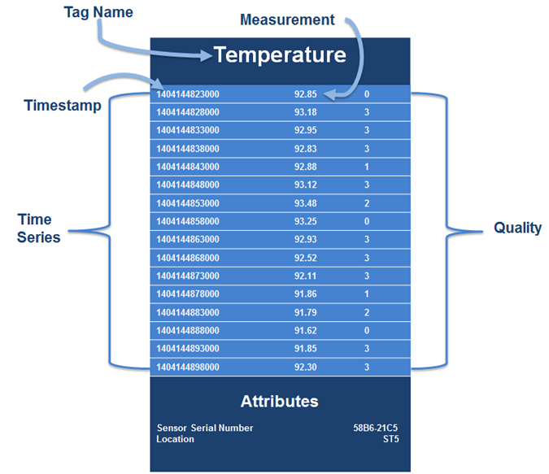
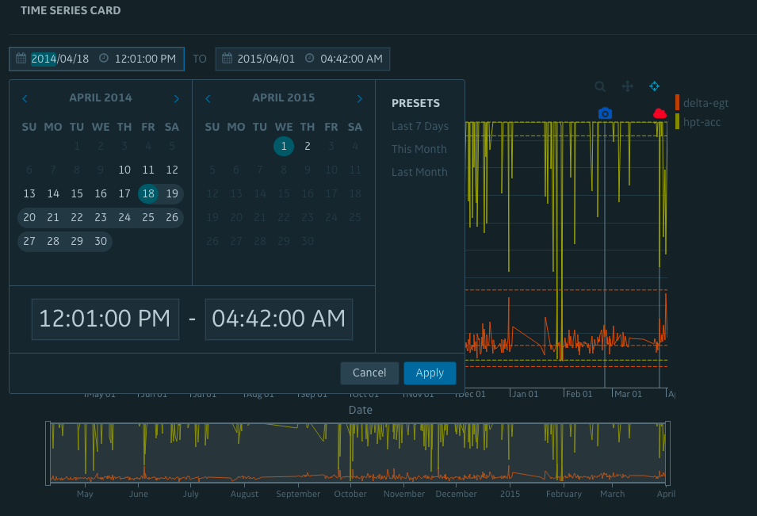

# Display time-series chart
In this tutorial we will create a time-series chart from existing time-series data, from existing JSON formatted time-series data points.

You will be using the following Predix UI component to assemble the chart features:
* iron-ajax
* px-rangepicker
* px-vis-data-converter
* px-vis-timeseries

## Understand time-series
Time Series data is a sequence of data points collected at set time intervals over a continuous period of time. Sensor data is a typical example of the common way to generate and collect time series data. A Time Series data store requires a measurement with a corresponding timestamp. The Time Series service provides an attributes field to include additional relevant details about the specific data point, such as units or site, for example, "Site":"SanFrancisco".



Time-series consists of two parts including *Data Ingestion* and *Data Query*:

* Ingestion: The data-ingestion layer provides the ability to ingest real-time streaming data.
* Query: The query API allows you to query data, with support for grouping of data points by tags, time ranges, or values, as well as aggregations. You can also filter by attributes to narrow your results.

In the seed app we have simplified this by storing time-series format data as JSON file, skipping the ingesting part which is still required in a real app, the element we will built here will issue a simple HTTP query to fetch the datapoints for display:

```
{
  "id": 1,
  "tags": [{
    "name": "delta-egt-cruise",
    "results": [{
      "datapoints": [
        [1397102460000, 11.4403],
        [1397139660000, 13.1913]
        // ...
      ]
    }]
  }],
  "events": [{
      "id": "123",
      "time": 1424803620000,
      "label": "Recalibrate"
    }, {
      "id": "456",
      "time": 1415286720000,
      "label": "Fan start"
    }, {
      "id": "789",
      "time": 1427525220000,
      "label": "Fan stop"
    }

  ],
  "max": 35.4784,
  "min": 7.6531,
  "mean": 15.330657585139331
}

```

## Create a time-series chart
We will create a `time-series-card.html` card to display the time-series data that is associated with asset `child-asset`, which is exactly the same element we defined as a card in view-service elaborated in the previous section.

We start by issue a fetch request to the `api/time-series` endpoint in `Express`, temporarily output the response object to data binding `rawTsData`.

```html
<iron-ajax
  url="/api/time-series/delta-egt/2?name=Compressor-2015:CompressionRatio&starttime=1y-ago"
  id="tsQueryElement"
  last-response="{{rawTsData}}"
  content-type="application/json"
  auto></iron-ajax>
```

#### Notes
[iron-ajax](https://www.webcomponents.org/element/PolymerElements/iron-ajax) is a element exposes network request functionality.

Because the format between what our stored time-series API provides, is slightly different from what the chart can consume, our next step is to use `px-vis-data-convertor` to transform the data into a more compact format that can be consumed by the chart component:

```html
<px-vis-data-converter
  data-key="data"
  id-key="name"
  original-data="[[originalData]]"
  series-config="{{seriesConfig}}"
  chart-data="{{chartData}}">
</px-vis-data-converter>
```

#### Notes
[px-vis-data-converter](https://github.com/PredixDev/px-vis/blob/master/px-vis-data-converter.html) is a element which can reformat the data into the object format and create a seriesConfig at the same time.

This will produce the following compact data format:

```js
[
 {
  "x": 1397102460000,
  "y0": 11.4403
 },
 {
  "x": 1397139660000,
  "y0": 13.1913
 },
 // ...
]
```

Eventually we can pipe data to the time-series chart using data-bindings:

```html
<px-vis-timeseries
  width="800"
  height="400"
  options="[[chartConfig]]"
  series-config="[[seriesConfig]]"
  chart-data="[[chartData]]"
  event-data="[[eventData]]"
  threshold-data="[[thresholdData]]">
</px-vis-timeseries>
```

Other than the time-series data-points, we also need to feed in other data like chart `events`, `threshold` and `seriesConfig` , which will be used by other chart features.

You may also find `chartConfig` another important option to make the chart working, which basically customize many chart features including event label, axis title and label formatting options, etc.

```js
{
	"eventConfig": {
		"Default": {
			"color": "red",
			"icon": "fa-circle",
			"type": "fa",
			"offset": [
				0,
				0
			]
		}
	},
	"xAxisConfig": {
		"title": "Date",
		"tickFormat": "%b %d"
	},
	"yAxisConfig": {
		"title": "Hz"
	}
}
```

## Create a time-series range picker
We have created the time-series chart above, while it has a length of totally one year, in order to drill down the time range we will hook up the chart’s **range** with a `px-rangepicker` component so user can change the total time span of the chart:

```html
<px-rangepicker
  id="rangepicker"
  range="{{range}}"
  date-format="YYYY/MM/DD"
  time-format="hh:mm:ss A"
  show-buttons="true">
</px-rangepicker>
```

On the first-time when this chart is loaded, we will align the range picker time range with the actual date range of the time-series data points, which will involve the following function:

```js
// set time range for rangepicker
_updateRangePicker: function(from, to) {
  var range = {
    from: new Date(from).toISOString(),
    to: new Date(to).toISOString(),
  };
  var $rangePicker = this.$.rangepicker;

  $rangePicker.range = range;

  ['from', 'to'].map(function(which) {
    var picker = $rangePicker.querySelector('px-calendar-picker#' + which);
    picker.blockDatesBefore = range.from;
    picker.blockDatesAfter = range.to;
    picker.baseDate = moment(range[which]);
  });
}
```

Eventually when user pick a date range from the calendar, the outputted range `range` shall be bound to the time-series chart, giving you a narrowed down view of the time-series.

```html
<px-rangepicker
  id="rangepicker"
  range="{{range}}"
</px-rangepicker>
```

As a final result, you shall have the following time-series chart displayed with two data series.


